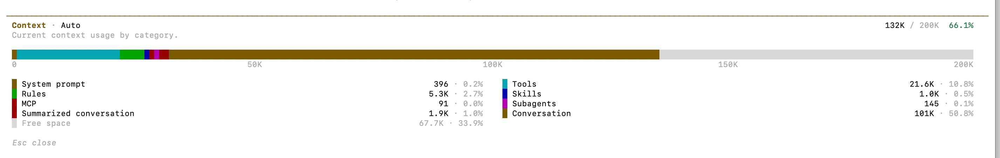

# Context Window (Memory Size)
- It defines how much text the model can “see” at once.

# Included items
- System prompt
- User input
- Conversation history
- Output

# Example
- 8K tokens → small memory
- 128K+ tokens → long conversations, documents
- 👉 If exceeded:
- Older messages get truncated (forgotten).

# References
- [Context Engineering vs Prompt Engineering](https://medium.com/data-science-in-your-pocket/context-engineering-vs-prompt-engineering-379e9622e19d)
- [Essential GraphRAG](https://neo4j.com/essential-graphrag/)
- [Prompt Engineering is dead.](https://www.youtube.com/watch?v=Cs7QiSi8KLY)
- [Effective context engineering for AI agents](https://www.anthropic.com/engineering/effective-context-engineering-for-ai-agents)
