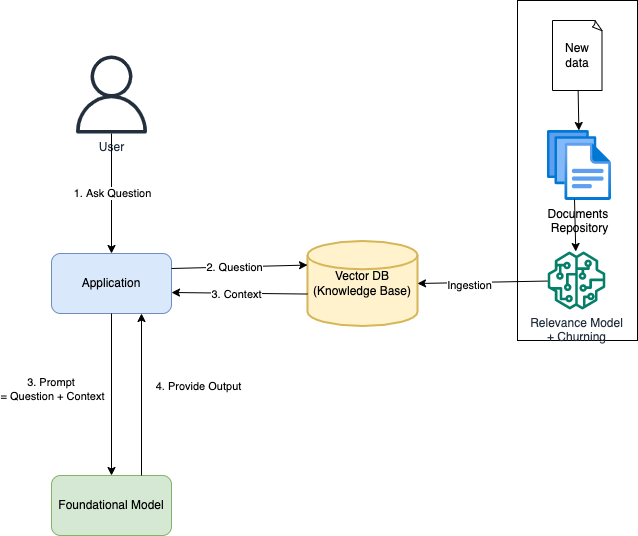

# Context Engineering (RAG)

# System Design

# References
- [Context Engineering vs Prompt Engineering](https://medium.com/data-science-in-your-pocket/context-engineering-vs-prompt-engineering-379e9622e19d)
- [Essential GraphRAG](https://neo4j.com/essential-graphrag/)