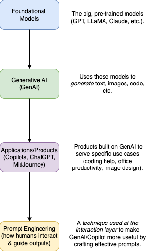

# What is prompt engineering?
- [Prompt engineering](https://aws.amazon.com/what-is/prompt-engineering/) is the process where you guide generative artificial intelligence (generative AI) solutions to generate desired outputs. 
- Even though generative AI attempts to mimic humans, it requires detailed instructions to create high-quality and relevant output. 
- In prompt engineering, you choose the most appropriate formats, phrases, words, and symbols that guide the AI to interact with your users more meaningfully. 
- Prompt engineers use creativity plus trial and error to create a collection of input texts, so an application's generative AI works as expected.

# Why is prompt engineering important?
- Prompt engineering jobs have increased significantly since the launch of [generative AI](../Generative-AI/Readme.md). 
- Prompt engineers bridge the gap between your end users and the [large language model](../Foundational-Models/LLM.md).

| Title                     | Description                                                                                                    |
|---------------------------|----------------------------------------------------------------------------------------------------------------|
| Greater developer control | Prompt engineering gives developers more control over users' interactions with the AI.                         |
| Improved user experience  | Users avoid trial and error and still receive coherent, accurate, and relevant responses from AI tools.        |
| Increased flexibility     | Higher levels of abstraction improve AI models and allow organizations to create more flexible tools at scale. |

# Terminologies

|                                    | Remarks                                                                                                                                                                                                                                    |
|------------------------------------|--------------------------------------------------------------------------------------------------------------------------------------------------------------------------------------------------------------------------------------------|
| [Components](Components/Readme.md) |                                                                                                                                                                                                                                            |
| Negative prompting                 | Negative prompting is used to guide the model away from producing certain types of content or exhibiting specific behaviors.  - It involves providing the model with examples or instructions about what it should not generate or do. |

# GenAI Tech Stack

# References
- [OpenAI - Prompt engineering](https://platform.openai.com/docs/guides/prompt-engineering)